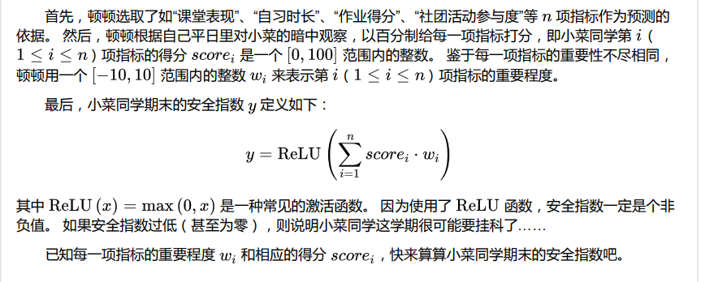
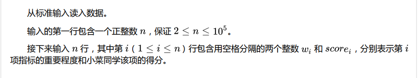
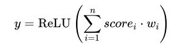

## 题目描述




## 输入格式



## 输出格式
输出到标准输出。  
输出一个非负整数 ，表示小菜同学期末的安全指数。

## 示例
::: tip 
输入：  
6    
2 60  
10 100  
0 70  
0 0  
-10 50  

输出：  
1220  

解释：  
y = ReLU (1220) = 1220

输入：  
2  
-10 100  
-1 15  
 
输出：  
0  

解释：  
y = ReLU (−1015) =  0  

:::  


## 算法设计
读完题目后感觉有点懵，但是仔细看一下输入输出示例就能明白其实就是一个简单的乘法和累加。  
  
输入第一行代表之后的行数，接下来输入n行，其中第i行包括两个数字，分别代表重要程度w和分数score。每一行就是一个科目的属性，所以我们可以把每一行写在一个二维数组里面，因为每一行都只有两个数据，所以也不复杂。当然我们也可以分开，把重要程度和分数单独存在独立的一维数组里面。我们把数据存到二维数组里面，然后根据公式  

  

可以看出就是把二维数组的每一行相乘，然后每一行的乘积再加上下面的每一行的乘积。
但是最后的结果一定不会小于0。所以我们有以下的代码。

## 代码
```c
#include <stdio.h>

#define N 100000

int ReLU(int n, int a[N][2]);
int main(){
	int a[N][2];
	int n;
	
	scanf("%d",&n);
	for(int i = 0;i < n;i++){
		for(int j = 0;j < 2;j++){
			scanf("%d",&a[i][j]);
		}
	}
	printf("%d",ReLU(n,a));
	
	return 0;
}

int ReLU(int n, int a[N][2]){
	int product = 0;
	int sum = 0;
	for(int i = 0;i < n; i++){
		product = a[i][0] * a[i][1];
		sum = product + sum;
	}
	if(sum < 0){
		sum = 0;
	}
	return sum;
}
```

## 复杂度分析  
时间复杂度：该程序的时间复杂度为O(n)。
空间复杂度：程序用到二维数组，但是也可以近似的认为复杂度为O(n)，因为每一层二维数组的长度为二。

## 感想
这是我第一次参加CCF，当看到题目的那一刻，觉得有点无从下手，因为之前的印象就是CCF很难，不过听说每一次的第一二题都是送分的，所以大家看到题目也不要慌，耐心看完题目，看不懂就多读几遍，多看看输出示例。第二题的题目更加难懂，但是只要我们好好捋一捋，还是会发现接替的思路的。