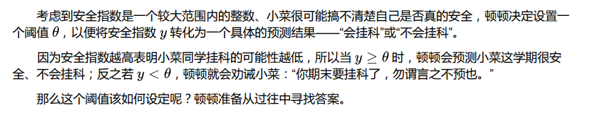
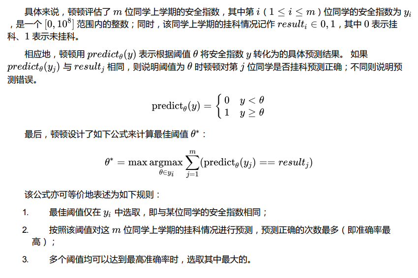
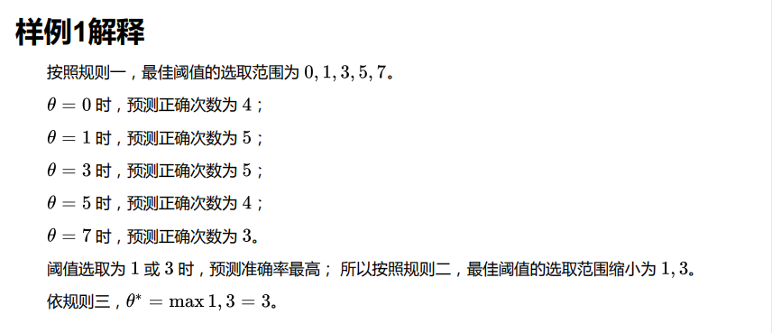
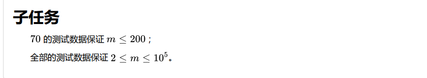

## 题目描述

  


## 输入格式
从标准输入读入数据。  
输入的第一行包含一个正整数 。
接下来输入 m 行，其中第 i（1<=i<=m）行包括用空格分隔的两个整数yi 和 resulti，含义如上
文所述。


## 输出格式
输出到标准输出。
输出一个整数，表示最佳阈值 Q。

## 示例
::: tip 
输入：    
6  
0 0  
1 0  
1 1  
3 1  
5 1  
7 1  

输出：  
3  

解释：  


输入：  
8  
5 1  
5 0  
5 0  
2 1  
3 0    
4 0     
100000000 1    
1 0    
 
输出：    
100000000    

:::  


## 算法设计
第二题题目读了四五也没有读懂，就好好研究了一下样例输入与输出。才搞懂题目的要求。
然后写代码的时候还没有发现其中的玄机。

其实一般的第二期就会考察到时间复杂度，对于70%的数据，m<200，所以如果时间复杂度没有考虑进去的话，一般来说就是只能得到70分，在我的算法中就出现了一个双重循环，所以只得到70分，目前我还没有改进好一个更加优化的算法，所以先提供出来仅供参考。

这个题其实并不难，只是稍微有点复杂，我的代码也不是很完美，接下来会继续修改。

## 代码
```c
#include <stdio.h>

# define N 10000

int BestThreshold(int n,int a[N][2]);
int Predict(int y,int q);

int main(){
	int a[N][2];
	int n;
	
	scanf("%d",&n);
	for(int i = 0;i < n;i++){
		for(int j = 0;j < 2;j++){
			scanf("%d",&a[i][j]);
		}
	}
	
	printf("%d",BestThreshold(n,a)); 
	
	return 0; 
} 

int BestThreshold(int n,int a[N][2]){
	int c[N];	//c数组存储着当q为任意值时，预测正确的次数
	for(int i = 0;i < n;i++){
		int sum = 0;
		int q = a[i][0];
		for(int j = 0;j < n;j++){
			int y = a[j][0];
			if(Predict(y,q) == a[j][1]){
				sum++;
			}
		} 
		c[i] = sum;  
	}
	
	/*找出c数组中的最大值，检测其个数 
	若是唯一的，则证明c数组下标对应的q就是题目要求的答案 
	若不唯一，则要选取最大值中对应c数组中下标最大的答案
	*/
	int max = c[0] ;
	
	for(int i = 0; i < n;i++){
		if(c[i] > max){
			max = c[i];
		}
	} 
	
	int d[N];
	 // 用于存放找到的最大值 
	for(int i = 0;i< n;i++){
		if(c[i] == max){
			d[i] = i;
		}
	}
	int maxq = d[0];
	for(int i = 0;i< n ;i++){
		if(d[i] > maxq){
			maxq = d[i];
		}
	} 
	return a[maxq][0];
}

//将阈值和安全指数转化为具体的预测结果 
int Predict(int y,int q){
	if(y >= q)
		return 1;
	else
		return 0;  
}
```

## 复杂度分析  
时间复杂度：该程序的时间复杂度为O(n^2)。
空间复杂度：程序用到二维数组，但是也可以近似的认为复杂度为O(n)，因为每一层二维数组的长度为二。

## 感想
这是我第一次参加CCF，当看到题目的那一刻，觉得有点无从下手，因为之前的印象就是CCF很难，不过听说每一次的第一二题都是送分的，所以大家看到题目也不要慌，耐心看完题目，看不懂就多读几遍，多看看输出示例。第二题的题目更加难懂，但是只要我们好好捋一捋，还是会发现接替的思路的。