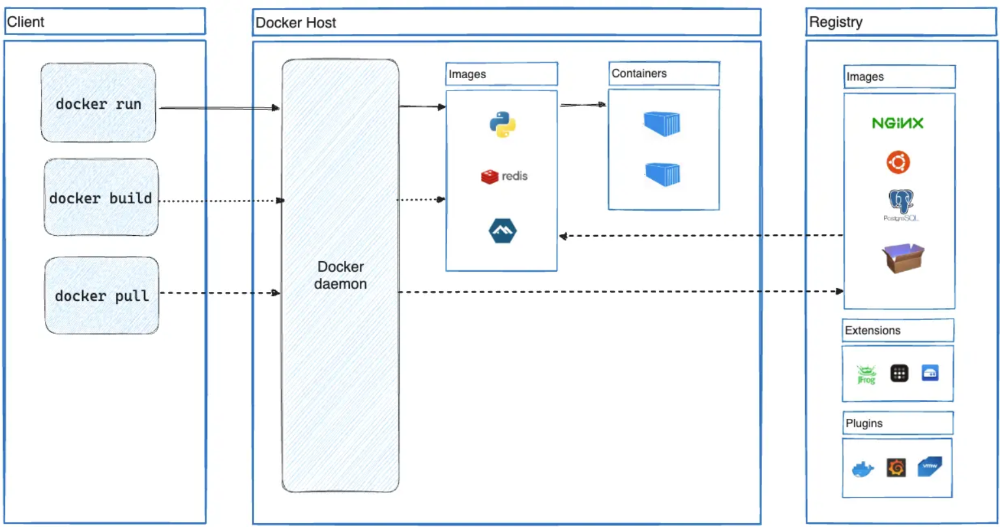

## Docker概述

**Docker 是一个用于开发、发布和运行应用程序的开放平台。**  Docker 是一种主流的容器化平台，它简化了创建、部署和运行应用程序的过程。通过利用 Docker 的方法来传送、测试和部署代码，可以显着减少编写代码和在生产中运行代码之间的延迟。

## 容器
Docker 提供了在称为容器的松散隔离环境中打包和运行应用程序的能力。容器化技术是一种轻量级的虚拟化方式，它允许将软件及其所有依赖项封装在一个可移植的容器中，这个容器几乎可以在任何地方运行，无论是在开发者的笔记本电脑、测试服务器还是生产环境，从而确保了环境的一致性。

## Docker的作用
- 快速、一致地交付您的应用程序
  - Docker 允许开发人员使用提供应用程序和服务的本地容器在标准化环境中工作，从而简化了开发生命周期。容器非常适合持续集成和持续交付 (CI/CD) 工作流程。
  - 开发人员在本地编写代码并使用 Docker 容器与同事共享他们的工作。
  - 使用 Docker 将应用程序推送到测试环境中并运行自动和手动测试。
  - 测试完成后，向客户提供修复就像将更新的映像推送到生产环境一样简单。

---

- 响应式部署和扩展

  Docker 基于容器的平台支持高度可移植的工作负载。 Docker 容器可以在开发人员的本地笔记本电脑、数据中心的物理机或虚拟机、云提供商或混合环境中运行。
Docker 的可移植性和轻量级特性还使得动态管理工作负载、根据业务需及时扩展或拆除应用程序和服务变得很容易。

---
- 在相同硬件上运行更多工作负载

  Docker 轻量且快速。

## Docker架构
Docker 使用客户端-服务器架构。 Docker 客户端(Client)与 Docker 守护进程(Daemon)通信，守护进程负责构建、运行和分发 Docker 容器的繁重工作。 Docker 客户端和守护进程可以在同一系统上运行，也可以将 Docker 客户端连接到远程 Docker 守护进程。
---

---

- **Docker 守护进程 ( dockerd )** 侦听 Docker API 请求并管理 Docker 对象，例如映像、容器、网络和卷。守护进程还可以与其他守护进程通信来管理 Docker 服务。

- **Docker 客户端 ( docker )** 是许多 Docker 用户与 Docker 交互的主要方式。当您使用 docker run 等命令时，客户端会将这些命令发送到 dockerd ，由后者执行这些命令。 docker 命令使用 Docker API。 Docker 客户端可以与多个守护进程通信。

- **镜像(Images)** 是一个只读模板，包含创建 Docker 容器的说明。通常，一个图像基于另一个图像，并进行一些额外的自定义。例如，您可以构建一个基于 ubuntu 映像的映像，但会安装 Apache Web 服务器和您的应用程序，以及运行应用程序所需的配置详细信息。

- **容器(containers)** 是镜像的可运行实例。您可以使用 Docker API 或 CLI 创建、启动、停止、移动或删除容器。您可以将容器连接到一个或多个网络，为其附加存储，甚至可以根据其当前状态创建一个新映像。默认情况下，容器与其他容器及其主机相对较好地隔离。您可以控制容器的网络、存储或其他底层子系统与其他容器或主机的隔离程度。

## 底层技术
Docker 使用 Go 编程语言编写，并利用 Linux 内核的多个特性来提供其功能。 Docker 使用一种名为 namespaces 的技术来提供称为容器的隔离工作空间。当您运行容器时，Docker 会为该容器创建一组命名空间。这些命名空间提供了一层隔离。容器的每个方面都在单独的命名空间中运行，并且其访问仅限于该命名空间。
