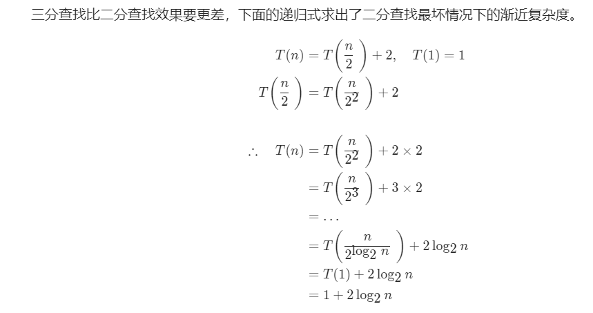
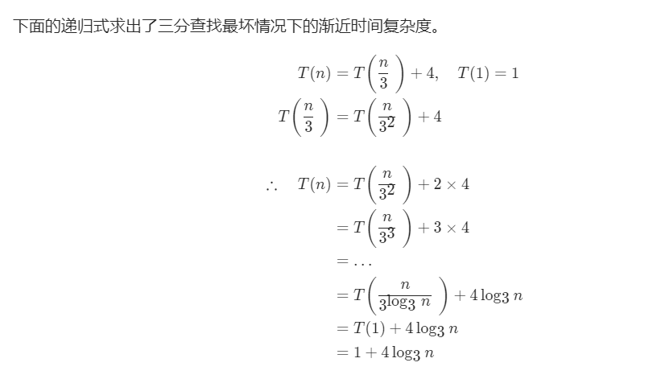
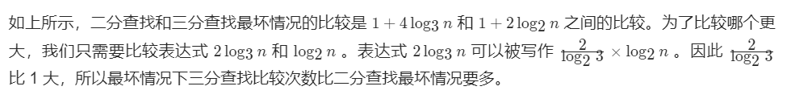

## 题目描述
猜数字游戏的规则如下：
> + 每轮游戏，我都会从 1 到 n 随机选择一个数字。 请你猜选出的是哪个数字。  
> + 如果你猜错了，我会告诉你，你猜测的数字比我选出的数字是大了还是小了。

你可以通过调用一个预先定义好的接口 int guess(int num) 来获取猜测结果，返回值一共有 3 种可能的情况（-1，1 或 0）：
> + -1：我选出的数字比你猜的数字小 pick < num  
> + 1：我选出的数字比你猜的数字大 pick > num  
> + 0：我选出的数字和你猜的数字一样。恭喜！你猜对了！pick == num  

## 示例
::: tip      
输入：n = 10, pick = 6    
输出：6   

输入：n = 1, pick = 1  
输出：1   

输入：n = 2, pick = 1  
输出：1  

输入：n = 2, pick = 2  
输出：2  
:::

提示：
::: tip  
1 <= n <= 231 - 1  
1 <= pick <= n  
:::

## 算法设计
使用暴力法，从1到n-1循环检查每一个数字，根据guess(int num) 来获取猜测结果，如果返回0，则代表猜对。但是暴力法会超出运算时间，所以我们用二分查找法。我们直接先检验中间数字，如果返回了-1，则证明猜测的数字小于答案要求的数字，则范围缩小到[middle + 1, right]，也就是令left = middle +1，相反，如果检验数字返回值为1，则证明猜测数字大于要求数字，范围应该在[left , middle - 1]。

我们也可以三分法，具体的方法和二分法差不多。

### 代码(暴力法)
最后的结果为：
```c
/** 
 * Forward declaration of guess API.
 * @param  num   your guess
 * @return 	     -1 if num is lower than the guess number
 *			      1 if num is higher than the guess number
 *               otherwise return 0
 * int guess(int num);
 */

int guessNumber(int n){
	for(int i = 1;i <= n;i++){
        if(guess(i) == 0){
            return i;
        }
    }
    return n;
}
```

### 复杂性分析(暴力法)
时间复杂度： O(n) 。我们从 1 到 n 扫描检查所有的数字。
空间复杂度： O(1) 。不需要使用额外空间。


### 代码(二分搜索法)
最后的结果为：
```c
/** 
 * Forward declaration of guess API.
 * @param  num   your guess
 * @return 	     -1 if num is lower than the guess number
 *			      1 if num is higher than the guess number
 *               otherwise return 0
 * int guess(int num);
 */

int guessNumber(int n){
    int left = 1;
    int right = n;
    while (left <= right) {
        int middle = left + (right - left) / 2;
        int res = guess(middle);
        if (res == 0)
            return middle;
        else if (res < 0)
            right = middle - 1;
        else
            left = middle + 1;
        }
    return -1;
}
```

### 复杂性分析(暴力法)
时间复杂度： O(log2n) 。为二分查找的时间复杂度。
空间复杂度： O(1) 。没有使用额外的空间。


### 代码(三分搜索法)
最后的结果为：
```c
/** 
 * Forward declaration of guess API.
 * @param  num   your guess
 * @return 	     -1 if num is lower than the guess number
 *			      1 if num is higher than the guess number
 *               otherwise return 0
 * int guess(int num);
 */

int guessNumber(int n){
    int left = 1;
    int right = n;
    while (left <= right) {
        int mid1 = left + (right - left) / 3;
        int mid2 = right - (right - left) / 3;
        int res1 = guess(mid1);
        int res2 = guess(mid2);
        if (res1 == 0)
            return mid1;
        if (res2 == 0)
            return mid2;
        else if (res1 < 0)
            right = mid1 - 1;
        else if (res2 > 0)
            left = mid2 + 1;
        else {
            left = mid1 + 1;
            right = mid2 - 1;
        }
    }
    return -1;
}
```

### 复杂性分析
时间复杂度：O(log3n)。
空间复杂度：O(1)。

## 二分查找和三分查找的比较
看起来三分查找会比二分查找更快，但是为什么二分查找使用得更广泛？

三分查找比二分查找效果要更差，下面的递归式求出了二分查找最坏情况下的渐近复杂度。

  



