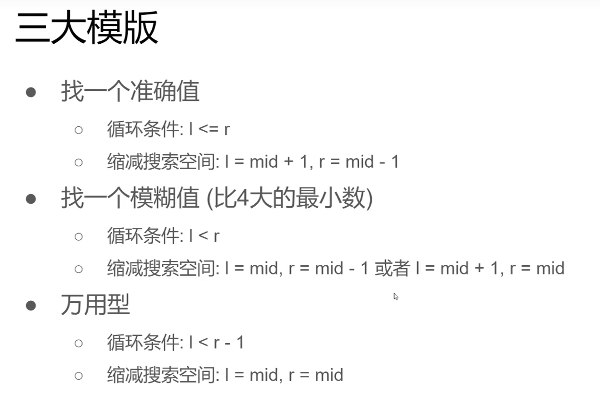

## 题目描述
符合下列属性的数组 arr 称为 山脉数组 ：  
- arr.length >= 3  
- 存在 i (0 < i < arr.length - 1)使得：  
    - arr[0] < arr[1] < ... < arr[i-1] < arr[i]  
    - arr[i] > arr[i+1] > ... >arr[arr.length -1]    

给你由整数组成的山脉数组 arr ，返回任何满足 arr[0] < arr[1] < ... < arr[i - 1] < arr[i] > arr[i + 1] > ... > arr[arr.length - 1] 的下标 i 。  

---

## 示例
::: tip  
输入：arr = [0,1,0]  
输出：1  

输入：arr = [0,2,1,0]  
输出：1  

输入：arr = [0,10,5,2]  
输出：1

输入：arr = [3,4,5,1]  
输出：2  

输入：arr = [24,69,100,99,79,78,67,36,26,19]  
输出：2   
:::  

---

## 提示
- 3 <= arr.length <= $10^4$
- 0 <= arr[i] <= $10^6$
- 题目数据保证 arr 是一个山脉数组  
- 很容易想到时间复杂度 O(n) 的解决方案，你可以设计一个 O(log(n)) 的解决方案吗？ 

## 算法设计
山脉数组就是一个先升后降的数组，且数组中没有重复元素。我们要找到山脉数组中最大值的下标，从示例我们可以看出，下标从0开始计算。  

根据山脉数组的性质，我们可以逐个查找元素，直到找到后一个元素的值小于前一个元素的值，那么前一个元素就是这个山脉数组的最大值，这个元素的下标就是我们需要的值。该思想的具体实现算法如下**int peakIndexInMountainArrayByLs(int* arr, int arrSize)**

题目的标签也是使用二分法，那就使用二分法来查找出这个元素的下标。  
二分法的基本思想就是利用两个指针从数组的两边检索整个数组，直到找到我们想要的结果。  
二分法的关键在于while语句的判定条件要不要小于等于，在本题中我们可以发现，山脉数组的元素是不会重复的，我们要找的是整个数组的最大值，所以在使用二分法的时候要注意边界的范围。具体的二分法使用，更具不同的场景，灵活使用。 

---
**二分查找算法的三大模板**  

---  

二分查找的套路以及模板在B站有一个详细的教程，[二分查找Binary Search套路和解题模板](https://www.bilibili.com/video/BV1Ng4y1q7E3?from=search&seid=14309897868937423862)。有疑惑的可以仔细看看，在多进行几道二分查找算法的训练强化一下。

## 代码

**线性搜索：**
```c
int peakIndexInMountainArrayByLs(int* arr, int arrSize) {
	int index = 0;
	while (arr[index] < arr[index + 1]) {
		index++;
	}
	return index;
}
```
---

**二分搜索：**  
```c
int peakIndexInMountainArray(int* arr, int arrSize) {
	int left = 0, right = arrSize;
	int mid;
	while (left < right) {
		mid = left + (right - left) / 2;
		if (arr[mid] < arr[mid + 1]) {
			left = mid + 1;
		}
		else {
			right = mid;
		}
	}
	return right;
}
```
---

## 复杂度分析     
**时间复杂度：**   
线性搜索中，时间复杂度为O(n)。  
二分搜索中，算法的时间复杂度为O(logn);

**空间复杂度：**   
线性搜索中，空间复杂度为O(1)。  
二分搜索中，空间复杂度为O(1);