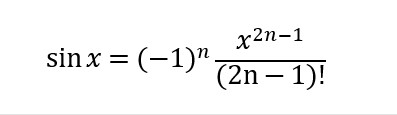
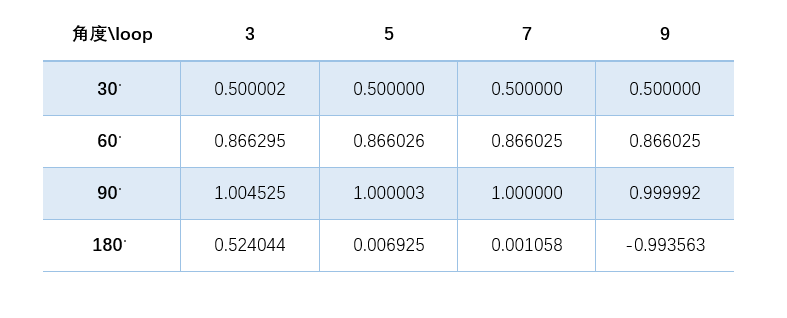

## 题目描述

欲求sin x 的近似值, 只能采用近似计算方法，用四则运算的式子来求得。



我们规定输入的x 值为角度制数值，公式需要弧度制数值，所以我们需要进行转化。


## 题目分析

虽然C语言的库函数有可以直接能求出sin x的值的函数，但是本题希望能够在不调用库函数的情况下，利用四则运算的公式来直接求的sin x的近似值。  
由公式我们可以看出，函数主要由三部分组成，第一部分是(-1)的n次方，主要是用来控制符号的。第二部分是分母的阶乘部分，我们可以单独编辑一个阶乘子函数[^Factorial]，使用时使用主函数调用。第三部分就是分子的次方函数[^NthRoot]，同样我们单独的编写一个子函数，使用时用主函数调用。

### 说明
通过公式我们可以看出，这个公式是一个可以无限循环的式子，但考虑到计算机的性能以及我们编程的目的，所以我们不需要进行很多次的循环。作为试验，我们分别进行3,5,7,9次循环，PI值取3.1415926.

### 代码 
```c
#include <stdio.h>

float PI = 3.1415926;    //定义全局变量PI 

int Factorial(int n);
float NthRoot(float radian,int n);

int main(){	
	int x = 0;
	float sinx = 0;
	printf("x的度数为：");
	scanf("%d",&x);
	printf("计算sin %d度的值为 ",x); 
	
	float radian = x * (PI/180);     //角度转化为弧度 
	
	int j =0;
	int loop = 9; //循环次数变量 

	for(int i = 1;i <= loop;i++){
		sinx = sinx+ NthRoot(-1,j) * ( NthRoot(radian,(2 * i) - 1) / Factorial((2 * i) -1) );
		j++; 
	}
	printf("%f\n",sinx);
	
	return 0;
}

int Factorial(int n){     //阶乘函数 
	if(n==0)
        return 1;
    return n*Factorial(n-1);
}

float NthRoot(float radian,int n){       //次方函数 
	float aver = 1;
	
	for(int j = 0;j < n; j++){
		aver = aver * radian;
	}	
	return aver;
}

```

### 运算结果分析



通过表格我们可以看出，随着循环次数的增加，运算结果的精度也在增加，在求解问题是，我们只需要满足题目要求的精度就可以，不用做多次循环，浪费时间和空间。
