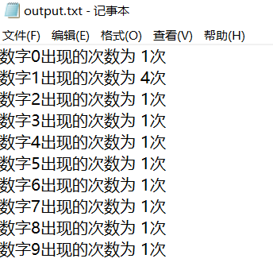

## 题目描述

一本书的页码从自然数1开始顺序编码直到自然数n。书的页码 按照通常的习惯编排，一个页码内都不包含多余的前导数字0.例如，第6页用数字6表示，而不是06或006等；数字计数问题要求给定书的总页码n，计算出书的全部页码中分别用到多少次数字0，1，……9。

### 算法设计

给定表示书的总页码的十进制整数 n (n的取值范围在1到10的9次方之间), 计算书的全部页码中分别用到多少次数字0, 1, 2, 3, 4, 5, 6, 7, 8, 9。

### 数据输入

输入数据由文件名为input.txt的文本文件提供。每个文件只有一行，给出表示书的总页码的整数n。

#### 输入文件示例


### 结果输出

程序运行结束时，将计算结果输出到文件output.txt中。输出文件共有10行，在地k行输出页码中用到的数字（k-1）的次数，k=1，2，……10.

#### 输出文件示例



## 题目分析

### 解法1
简单的来说就是通过循环统计出每个数字出现的次数，通过数组a来分别统计每个数字出现的次数。通过count数组来记录每个数字出现的次数，

#### 代码 
```c
#include<stdio.h>
#include<stdlib.h>
int a[10]={0};	
void count(int n)
{
    while (n > 0)
    {
        a[n%10] += 1;
        n = n/10;
    }
}
int main()
{
	int i,j,n;
	freopen("D:\\002算法设计与分析\\001算法设计与分析实验题\\input.txt", "r", stdin);           
	freopen("D:\\002算法设计与分析\\001算法设计与分析实验题\\output.txt","w",stdout) ; 
    int temp;
	scanf("%d",&temp);              
	for(i=1;i<=temp;i++) 
	{
	 count(i); 
    }
	 for(j=0;j<=9;j++)
	{
	    printf("数字%d出现的次数为 %d次\n",j,a[j]);
	}	         
}

```

#### 时间复杂度
我们可以看出，在主函数中，需要从i循环到temp，就是相当于逐个把每个页码取出来，然后在统计这个数字中0，1，2，3，4，5，6，7，8，9出现的次数。这个循环需要循环页码的最大次值，就是n，记为O(n);在count子函数中，每个数还需要除法和求余运算，举个例子，假如是101，我们首先进入循环后得到a[1]加一，然后101/10得到10，一次循环结束，现在n=10,10大于0则继续循环，10%10=0，a[0]加一，10/10得到1，二次循环结束，此时n=1，1大于0，继续循环，1%10得1，a[1]加一，1/10得0，第三次循环结束，此时n=0，0不大于0，循环结束。我们由此可以看出，在count函数中，循环得次数为log10(n),则此程序得总体的时间复杂度为n*log10(n)。题目要求的n是在1到10的9次方之间的数值，当n很大时，就会耗费很多的时间，所以我们可以对算法进行改进。

### 解法2
其实，我们可以看出，数字都是会重复的，在1~9,1~19,到大一点的数字比如1000~9999，这些数字都是重复性出现而且有规律的，所以在大一点的数字时，我们需要改进我们的算法，达到节省时间的目的。比如，34567这个数字，从0到9999，这个区间的每个数字的出现次数可以使用原著中给出的递推公式，即每个数字出现4000次。
从10000到19999，中间除去万位的1不算，又是一个从0000到9999的排列，这样的话，从0到34567之间
的这样的区间共有3个。所以从00000到29999之间除万位外每个数字出现次数为3*4000次。然后再统计
万位数字，每个区间长度为10000，所以0,1,2在万位上各出现10000次。而3则出现4567+1=4568次。
之后，抛掉万位数字，对于4567，再使用上面的方法计算，一直计算到个位即可。


#### 代码
```c
#include<stdio.h>
#include<math.h>

void statNumber_iterative(int n);

int count[10] = {0};

int main()
{
	int i,j,n;
	freopen("D:\\002算法设计与分析\\001算法设计与分析实验题\\input.txt", "r", stdin);           
	freopen("D:\\002算法设计与分析\\001算法设计与分析实验题\\output.txt","w",stdout) ; 
    int temp;
	scanf("%d",&temp);      //temp就是文件input的输入数字 
    statNumber_iterative(temp);

	for(j=0;j<=9;j++)
	{
	    printf("数字%d出现的次数为 %d次\n",j,count[j]);
	}       
}

void statNumber_iterative(int n) {
  int len, i, k, h, m;
  int pow10[12] = {1,10,100,1000,10000,100000,1000000,10000000,100000000,1000000000};
  char d[16];
  len = log10(n);   /* len表示当前数字的位权 */
  m = len;
  sprintf(d, "%d", n);
  k = 0;     /* k记录当前最高位数字在d数组中的下标 */
  h = d[k] - '0';   /* h表示当前最高位的数字 */
  printf("%d\n",h); 
  n %= pow10[len];    /* 去掉n的最高位 */
  while(len > 0) {
  if(h == 0) {
    count[0] += n + 1;
    h = d[++k] - '0';
    --len;
    n %= pow10[len];
    continue;
  }
  for(i = 0; i < 10; i++) {
    count[i] += h * len * pow10[len-1];
  }
  for(i = 0; i < h; i++) {
    count[i] += pow10[len];
  }
  count[h] += n + 1;
  --len;
  h = d[++k] - '0';
  n %= pow10[len];
  }
  for(i = 0; i <= h; i++) {
  count[i] += 1;
  }
  /* 减去前导0的个数 */
  for(i = 0; i <= m; i++) { 
  count[0] -= pow10[i];
  }

}

```

#### 时间复杂度
在解法2中，我们利用重复的特性，可以省去一些不要必要的运算，我们的算法时间复杂度也降到了log10(n)，大大节省的运算的时间。