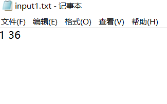

## 题目描述

正整数x的约数是能整除x的正整数。正整数x的约数个数记为div(X)。例如，1，2，5，10都是正整数10的约数，且div(10)=4。设a和b是2个正整数，a小于等于b,找出a和b之间约数个数最多的数x。

### 算法设计

对于给定的2个正整数a小于等于b,计算a和b之间约数个数最多的数。
### 数据输入

输入数据由文件名为input.txt的文本文件提供。文件第一行有2个正整数a和b。

### 注意
输入的数据为符合题目要求的正整数，在算法在默认输入的数据都是符合要求的数据。

#### 输入文件示例



### 结果输出

若找到的a和b之间的约数个数最多的数是x,则将div(x)输出到文件output.txt。

#### 输出文件示例


## 题目分析

### 解法1
暴力解法，循环遍历，从1除到自身，能整除的话，count加一，count的值就是约数的个数，在比较一下约数个数的大小，最后输出值。

#### 代码 
```c
#include<stdio.h>

int submultiple(int n);

int main()
{
	
	freopen("D:\\002算法设计与分析\\001算法设计与分析实验题\\003最多约数问题\\input1.txt", "r", stdin);
	freopen("D:\\002算法设计与分析\\001算法设计与分析实验题\\003最多约数问题\\output1.txt","w",stdout); 
    int a,b,min,max;
	scanf("%d %d",&a,&b);      //input文件夹中的a b
	
	min = submultiple(a);
    max = submultiple(b);
	
	if(min < max){
		printf("a和b之间约数个数最多的是%d，约数个数有%d",b,submultiple(b));
	}
	else{
		printf("a和b之间约数个数最多的是%d，约数个数有%d",a,submultiple(a));
	}
		       
}

int submultiple(int n){  //求约数个数的子函数 
	int count = 0;
	for(int i = 1;i <= n;i++){
		if( n % i == 0){
			count = count +1;
		}
	}
	return count;
}

```

#### 时间复杂度
每个输入的x都需要从1除到本身，循环n次,时间复杂度为O(n)。

### 解法2


#### 代码
```c

```

#### 时间复杂度
