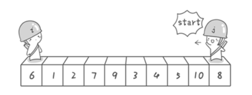
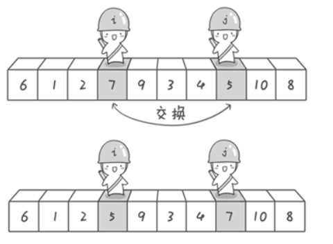
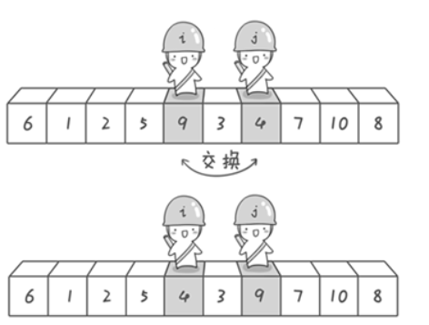
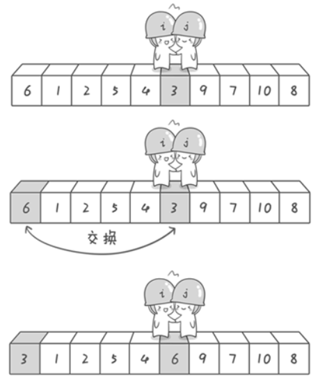

## 题目描述

快速排序算法是基于分治策略的一个排序算法。快速排序可能是应用的最广泛的排序算法了，快速排序流行的原因是它实现简单、适用于各种不同的输入数据且在一般应用中比其他排序算法都要快得多。
快速排序的时间复杂度：
| | |
| :----:|:--------------:|
| 最好 | O(nlog(n))|
| 最坏 | O(n^2)|


## 算法设计
设需要排序的数组为a[p:r]，默认升序排列;

快速排序主要分三个步骤：

+ 分解：把数组以a[p]为基数分为两个部分()，在a[q]以前的任何一个元素都小于等于a[p]，a[q+1]到a[r]的元素都大于等于a[p]。q的值并不一定是数组长度的中间值。
+ 递归求解：通过递归调用快速排序算法，分别对两部分数组排序。
+ 合并；对排完序的两个数组直接合并。

如何进行分解呢？
数组a[p:r]，我们先取a[p]为基数，设定两个指针i和j,i指向数组的第一个地址，j指向数组的最后一个元素的地址，我们首先从数组的右端寻找，找到一个值小于a[p]元素，然后向右移动i指针，知道找到一个值大于a[p]的元素，交换两个指针指向的值，直到两指针相遇为止，如此以往。

示意图：









## 快速排序的优缺点
| | |
| :----:|:--------------:|
| 优点 | 原地排序，只需要一个很小的辅助栈，内循环比大多数的排序算法短小|
| 缺点 | 脆弱，实现时要避免低劣的性能|


### 解法1
简单的快速排序，还未改进算法。

### 代码 
```c
#include<stdio.h>

void sort(int a[], int lo, int hi);
int partition(int a[], int lo ,int hi);
void swap(int a[], int i, int j);

int main(){
	int a[10]={35,47,69,32,51,86,45,12,10,2};

	sort(a,0,10);
	
	for(int i = 0;i < 10;i++){
		printf("%d\n",a[i]);
	}
}

void sort(int a[], int lo, int hi){
	if(hi <= lo) return;
	int j = partition(a, lo ,hi);
	sort(a, lo, j - 1);
	sort(a, j + 1, hi);
}

int partition(int a[], int lo ,int hi){
	int i = lo , j = hi + 1;
	int temp = a[lo];
	while(true){
		while(a[++i] < temp && i < hi);
		while(a[--j] > temp);
		if(i>=j) break;
		swap(a, i, j);
	}
	swap(a, lo, j);
	return j;
}

void swap(int a[], int i, int j){
	int temp = a[i];
	a[i] = a[j];
	a[j] = temp;
}

```

### 时间复杂度
每个输入的x都需要从1除到本身，循环n次,时间复杂度为O(n)。

### 解法2


### 代码
```c

```
