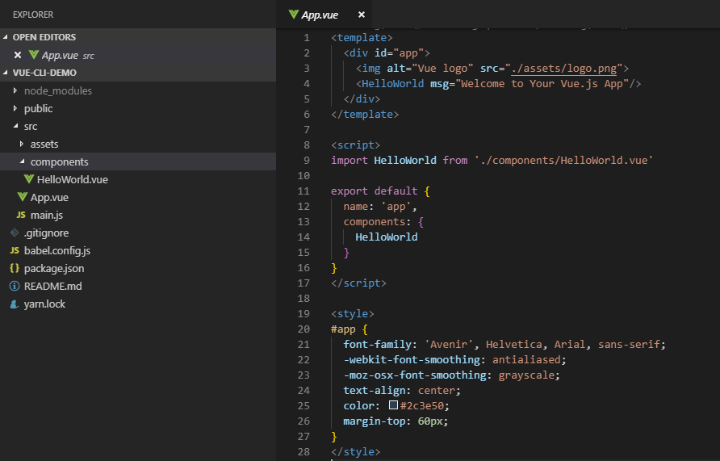
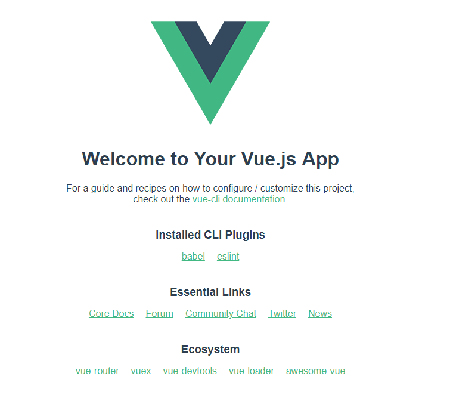
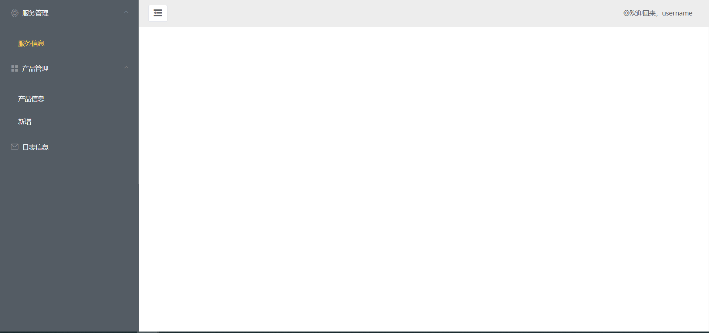
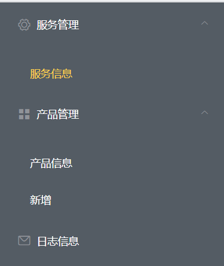

## 准备

### Node

#### 什么是Node
Node（正式名称 Node.js）是一个开源的、跨平台的运行时环境，有了它，开发人员可以使用 JavaScript 创建各种服务器端工具和应用程序。此运行时主要用于浏览器上下文之外（即可以直接运行于计算机或服务器操作系统上）。据此，该环境省略了一些浏览器专用的 JavaScript API，同时添加了对更传统的 OS API（比如 HTTP 库和文件系统库）的支持。

从 web 服务器开发的角度来看，Node 有很多好处：

* 卓越的性能表现！Node 为优化 web 应用的吞吐量和扩展度而生，对常见的 web 开发问题是一套绝佳方案（比如实时 web 应用）。
* 代码还是熟悉的老伙伴 JavaScript，这意味着在客户端和服务器端“上下文切换”的时间成本更低。
* 与传统的 web 服务器语言（例如 Python、PHP 等）相比，JavaScript 理念更新，语言设计的改进带来了诸多好处。许多其它新近流行的语言也可编译/转换成 JavaScript，所以TypeScript、CoffeeScript、ClojureScript、Scala、LiveScript 等等也可以使用。
* Node 包管理工具（node package manager，NPM）提供了数十万个可重用的工具包。它还提供了一流的依赖解决方案，可实现自动化工具链构建。
* Node.js 是可移植的，可运行于 Microsoft Windows、macOS、Linux、Solaris、FreeBSD、OpenBSD、WebOS 和 NonStop OS。此外，许多 web 主机供应商对其提供了良好支持（包括专用的基础框架和构建 Node 站点的文档）。
* 它有一个非常活跃的第三方生态系统和开发者社区，很多人愿意提供帮助。

可以用 Node.js 的 HTTP 包来创建一个简单的 web 服务器

#### 安装Node
Node.js可以直接从官网下载并安装
[Node.js下载地址](https://nodejs.org/en/download/)

### Vue和Vue.cli
#### 安装Vue
Vue是一套用于构建用户界面的渐进式框架。与其它大型框架不同的是，Vue 被设计为可以自底向上逐层应用。Vue 的核心库只关注视图层，不仅易于上手，还便于与第三方库或既有项目整合。另一方面，当与现代化的工具链以及各种支持类库结合使用时，Vue 也完全能够为复杂的单页应用提供驱动。


在用 Vue 构建大型应用时推荐使用 NPM [安装Vue](https://cn.vuejs.org/v2/guide/installation.html)。NPM 能很好地和诸如 webpack 或 Browserify 模块打包器配合使用。同时 Vue 也提供配套工具来开发单文件组件。

```bash
# 最新稳定版
$ npm install vue
```

#### 安装Vue.cli
Vue CLI 是一个基于 Vue.js 进行快速开发的完整系统，提供：

* 通过 @vue/cli 搭建交互式的项目脚手架。
* 通过 @vue/cli + @vue/cli-service-global 快速开始零配置原型开发。
* 一个运行时依赖 (@vue/cli-service)，该依赖：
    - 可升级；
    - 基于 webpack 构建，并带有合理的默认配置；
    - 可以通过项目内的配置文件进行配置；
    - 可以通过插件进行扩展。
* 一个丰富的官方插件集合，集成了前端生态中最好的工具。
* 一套完全图形化的创建和管理 Vue.js 项目的用户界面。
Vue CLI 致力于将 Vue 生态中的工具基础标准化。它确保了各种构建工具能够基于智能的默认配置即可平稳衔接，这样你可以专注在撰写应用上，而不必花好几天去纠结配置的问题。与此同时，它也为每个工具提供了调整配置的灵活性，无需 eject。

[安装Vue.cli脚手架](https://cli.vuejs.org/zh/guide/installation.html)

```bash
// 安装脚手架
npm install -g @vue/cli
// 查看版本
vue --version
```

### 利用Git生成Cli脚手架
通常来说，脚手架可以让你快速地生成示例代码、搭建本地环境，也可以更新依赖的版本等，避免了每个开发者自行调整开发环境、打包逻辑等配置。Vue cli 也提供了这样的能力：对 Babel、TypeScript、ESLint、PostCSS、PWA、单元测试和 End-to-end 测试提供开箱即用的支持

脚手架生成 Vue 项目
```bash
vue create vue-cli-demo
```

生成之后的代码目录:



::: tip
可以把项目名称修改为自己需要的
:::

启动项目你将能看到一个用Vue.cli搭建好的网页

::: tip
一般来说，比较规范的项目都会有个 README.md 文件，我们可以通过该文件看到项目相关的一些内容，包括项目背景、项目启动和构建、相关负责人等说明。在这里，我们使用 Vue CLI 生成的项目 Demo 也有一个 README.md 文件。
:::

打开这个文件，我们能看到一些简单的说明:
```md
# vue-cli-demo

## Project setup

npm install

### Compiles and hot-reloads for development

npm run serve

### Compiles and minifies for production

npm run build

### Lints and fixes files

npm run lint

### Customize configuration
See [Configuration Reference](https://cli.vuejs.org/config/).
```

现在启动项目

```bash
\\ 如果现在的位置在vue-cli-dome目录下
npm run serve
```
Vue CLI 生成的 Demo 效果:



接下来我们将进行对页面的修改。

## 设计Home页面
这是一个很简单的管理网页，Home页面是我们最基本的页面，功能可以理解为电脑桌面

这是我们的Home页面，这一章节也是我们最后实现的目标

### 配置路由

路由是为了我们有更好的使用体验，在过去，服务端处理来自浏览器的请求时，要根据不同的 URL 路由拼接出对应的视图页面，通过 Http 返回给浏览器进行解析渲染。使用这种方式加载页面，整个页面都需要重新加载，导致体验不够友好。随着几年前 AngularJS、React、Ember 等这些框架的出现，Web 应用也随之出现。Web 应用则是使用了局部刷新的能力，在路由信息变更的时候进行局部页面内容的刷新（而不是重新加载一个完整的页面），从而获取更好的体验。

首先我们看到main.js这个文件，它相当于是一个程序的入口。在这里我们需要配置各种各样的路由，引入多个全局组件

::: tip
国内比较热门的组件库大概有 Antd、Element、iView 等，Antd 主要是基于 React.js 的，虽然也支持了 Vue 和 Angular，但整体组件库风格偏自由灵活，而自由灵活往往也是有代价的。Element 和 iView 都是基于 Vue.js 的.当然，可以根据自己的喜好来选择组件库。
:::

[点击这里了解Element组件](https://element.eleme.io/#/zh-CN)

我们在main.js里添加的路由:
```js
import VueRouter from "vue-router";

Vue.use(VueRouter); // 使用 vue-router

const routes = [
  {
    path: "/", // 父路由路径
    component: App, // 父路由组件，传入 vue component
    name: "App", // 路由名称
    // 设置子路由
    children: [
      {
        // 应用首页
        path: "home", component: Home,  name: "Home",
      }
    ]
  }
];

const router = new VueRouter({
  routes // （缩写）相当于 routes: routes
});

new Vue({
  router,
  render: h => h(App),
}).$mount('#app')
```

### 生成Home页面

我们应用到了Element组件，所以我们还应该在main.js里引进组件及其样式，不过单纯的引进是不够的，我们还需要安装。推荐使用npm安装，它能更好地和 webpack 打包工具配合使用。

#### npm 安装
```md
npm install element -ui --save
```

#### CDN 安装
目前可以通过 [unpkg.com/element-ui](https://unpkg.com/browse/element-ui@2.13.0/) 获取到最新版本的资源，在页面上引入 js 和 css 文件即可开始使用。

```html
<!-- 引入样式 -->
<link rel="stylesheet" href="https://unpkg.com/element-ui/lib/theme-chalk/index.css">
<!-- 引入组件库 -->
<script src="https://unpkg.com/element-ui/lib/index.js"></script>
```

在main.js 文件中添加组件
```js
import ElementUI from "element-ui"; // 引入 element 组件
import "element-ui/lib/theme-chalk/index.css"; // 加上 element 样式

import App from './App.vue';
import Home from "./pages/home/Home.vue";
```

然后转入到App.vue 文件 设置Vue的三件套:
```vue
<template>
  <!-- 使用 <router-view></router-view> 来嵌套路由 -->
  <router-view></router-view>
</template>

<script>
export default {
  name: 'app'
}
</script>

<style>
html, body {
  margin: 0;
  height: 100%;
}
#app{
  height: 100%;
}
</style>
```

接下来就是正式设计Home页面  
创建Menu.vue文件在./src/components下



我们能看到，菜单列表主要包括父菜单列表，每个父菜单包括:
* 图标 icon
* 菜单名字 text
* (可选)子菜单列表 subMenus，以及子菜单名字 text

所以我们可以抽象出一个数据结构:
```js
const menus = [
  {
    text: "服务管理", // 父菜单名字
    icon: "el-icon-setting", // 父菜单图标
    subMenus: [{ text: "服务信息" }, { text: "新增" }] // 子菜单列表
  },
  {
    text: "产品管理",
    icon: "el-icon-menu",
    subMenus: [{ text: "产品信息" }]
  },
  {
    text: "日志信息",
    icon: "el-icon-message"
  }
];
```
##### 应用菜单栏
``` js
// Menu.vue
const menus = [
    、、、、、
]

export default {
  data() {
    return {
      menus, // menus: menus 的简写
    };
  },
  props: {
    isMenuCollapse: Boolean
  },
  methods: {}
};
```

##### 菜单绑定
``` html
<!-- Menu.vue -->
<template>
  <!-- 顺便调整了下颜色 -->
  <el-menu
    :collapse="isMenuCollapse"
    :default-openeds="['0', '1']"
    class="el-menu-vertical-demo"
    background-color="#545c64"
    text-color="#fff"
    active-text-color="#ffd04b"
  >
    <!-- 遍历生成父菜单选项 -->
    <template v-for="menu in menus">
      <!-- 有子菜单的时候，就用 el-submenu，再绑个序号 index -->
      <el-submenu
        v-if="menu.subMenus && menu.subMenus.length"
        :index="menu.index"
        :key="menu.index"
      >
        <template slot="title">
          <!-- 绑个父菜单的 icon -->
          <i :class="menu.icon"></i>
          <!-- 再绑个父菜单的名称 text -->
          <!-- slot 其实类似于占位符，可以去 Vue 官方文档了解一下插槽 -->
          <span slot="title">{{menu.text}}</span>
        </template>
        <el-menu-item-group>
          <!-- 子菜单也要遍历，同时绑上子菜单名称 text，也要绑个序号 index -->
          <el-menu-item
            v-for="subMenu in menu.subMenus"
            :key="subMenu.index"
            :index="subMenu.index"
          >{{subMenu.text}}</el-menu-item>
        </el-menu-item-group>
      </el-submenu>
      <!-- 没子菜单的时候，就用 el-menu-item，也要绑个序号 index -->
      <el-menu-item v-else :index="menu.index" :key="menu.index">
        <!-- 绑个父菜单的 icon -->
        <i :class="menu.icon"></i>
        <!-- 再绑个父菜单的名称 text -->
        <span slot="title">{{menu.text}}</span>
      </el-menu-item>
    </template>
  </el-menu>
</template>
```

最后再加上渲染样式就可以啦
```css
.el-menu-vertical-demo:not(.el-menu--collapse) {
  width: 300px;
  min-height: 400px;
}
```